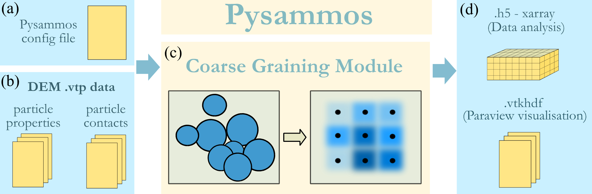
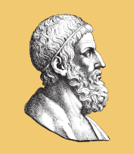

.. pysammos_docs documentation master file, created by
   sphinx-quickstart on Wed Aug 13 09:16:58 2025.
   You can adapt this file completely to your liking, but it should at least
   contain the root `toctree` directive.

Home
====

**Pysammos** is a Python package designed with the outlook of providing a user-friendly 
CG workflow to post-process data form the MFiX open-source DEM software, 
and provide a streamlined visualisation in widely-used open-source visualisation software,
Paraview. This code package provides flexibility in the output variable selection, 
mesh parametrisation, and data analysis of the obtained results. Pysammmos is also 
designed to invite geoscientists to incorporate DEM in their research, as many processes 
studied in geosciences involve discrete elements that are currently modelled as a continuum 
could benefit from a discrete insight. Similarly, to enhance DEM analysis by extracting continuum 
fields without the need to handle inner-level source code. The efficient algorithmic complexity 
exhibited by Pysammos avoids the requirement of extensive computational resources, making it a 
programme that can be ran on at the same time as other processes.  

**Features:**

- Processes MFIX-DEM simulation data
- Processes particle data of any shape and size distribution
- Customisable coarse-graining mesh
- Outputs continuum fields in vtkhdf format for Paraview visualisation and in h5 format for data analysis
- Benchmarked against other open-source and commercial CG codes
- Open-source and free to use

| 

**Who was the Sand Reckoner?**

The Sand (psammos, in greek) Reckoner is a work by Archimedes, in which he endeavoured to determine the 
number of grains of sand that could fit in the universe. To do so, he invented a new system of large number 
notation, as the number system at that time could only express numbers up to a myriad (10,000). 
Our open source code is able to process any granular model in the universe no matter the number of grains! In 
fact, the more, the *myriar*.

Contents
--------

.. toctree::
   :maxdepth: 1

   installation
   modules
   examples
   benchmarks
   license
   

Project Information
-------------------

**Funding**

This project has received funding from the NERC Edinburgh Earth Ecology and 
Environment Doctoral Training Partnership grant NE/S007407/1. 

**Collaborators**

This project has been developed with the contribution of the following collaborators:

- Dr. Eric C. P. Breard (University of Edinburgh)

- Dr. Mark Naylor (University of Edinburgh)

- Dr. John P. Morrissey (University of Edinburgh)

- Dr. Patrick J. Zrelak (University of Edinburgh)

**Contacts**

For any questions, suggestions or collaborations, please contact:

- Lead developer: Claudia Elijas Parra (claudia.elijas.parra@gmail.com)

- Supervisor: Dr. Eric C. P. Breard (eric.breard@ed.ac.uk)

