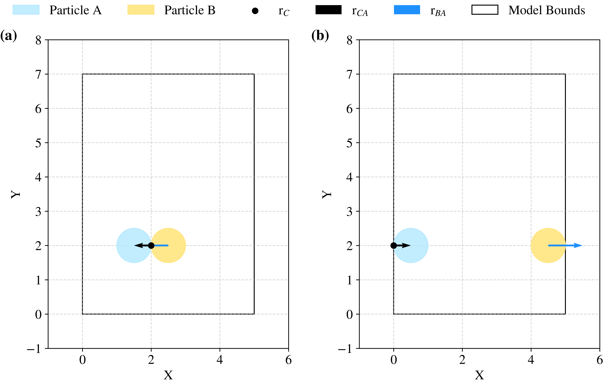

Complete
========

pysammos.data\_handle.contacts.complete package

Subpackage for completing contact data with additional information, 
such as branch vectors and coordination numbers.

.. automodule:: pysammos.data_handle.contacts.complete
   :members:
   :undoc-members:
   :show-inheritance:

Branch Vectors module
---------------------

pysammos.data\_handle.contacts.complete.branch\_vectors module

Periodic boundary corrections along each axis using the Minimum Image Convention (MIC), by which displacements are calculated to the nearest periodic equivalent, as showen in the figure below. 

   **Example of minimum image convention.** Two-dimensional illustration of the application of the Minimum Image
   Convention (MIC) for particle pairs located well within the model domain
   (a) and interacting across periodic boundaries (b). In case (b),
   displacement vectors are computed using the nearest periodic image.
   All particles have identical radius (:math:`r = 0.5`). The contact point,
   :math:`r_C`, is defined on particle :math:`A` (purple) and is depicted
   with a black point. The branch vector from the contact point to the
   centre of particle :math:`A`, :math:`r_{CA}`, is shown by the black arrow,
   while the vector from the centre of particle :math:`B` (red) to the centre
   of particle :math:`A`, :math:`r_{BA}`, is indicated by the blue arrow.
   The boundaries of the model domain are delineated by the black box.

.. automodule:: pysammos.data_handle.contacts.complete.branch_vectors
   :members:
   :undoc-members:
   :show-inheritance:

Coordination Number module
--------------------------

pysammos.data\_handle.contacts.complete.coordination\_number module

.. automodule:: pysammos.data_handle.contacts.complete.coordination_number
   :members:
   :undoc-members:
   :show-inheritance:
