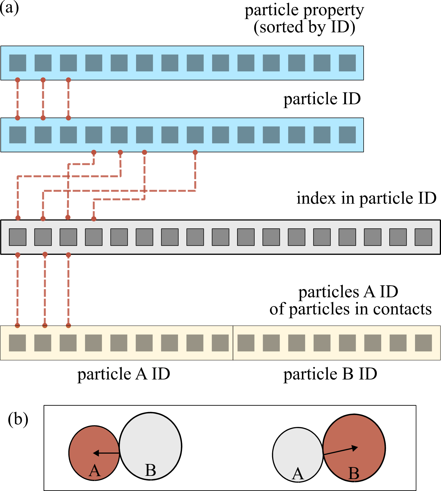

Contacts
========

pysammos.data\_handle.contacts package

Subpackage for handling contact data.

.. automodule:: pysammos.data_handle.contacts
   :members:
   :undoc-members:
   :show-inheritance:

.. toctree::
   :maxdepth: 4

   pysammos.data_handle.contacts.complete
   pysammos.data_handle.contacts.qualitycheck

Particle Mapper module
----------------------

pysammos.data\_handle.contacts.particle\_mapper module

It is necessary to map the contact data (particle interaction pairs and force)
to the particle data (position and diameter), so that the branch vectors of
particle interactions can be calculated.

On the one hand, the particle data consists of the following arrays: particle
ID, particle diameter, mass, velocity, and position. On the other hand,
contact data consists of the following arrays: the particle ID of the particles
upon which the contact force is exerted (particles :math:`A`), the force acting
on particles :math:`A`, and the particle ID of the particles in contact with
particles :math:`A` (particles :math:`B`).

The arrays containing the contact data are concatenated such that both
perspectives of the interaction are accounted for in a single array
(i.e., :math:`A_{con} = \{A, B\}` and :math:`B_{con} = \{B, A\}`).

This allows the Coarse-graining equations to be applied directly to the contact data. Hence, the contact-to-particle data mapping
involves associating each element of :math:`A_{con}` (and :math:`B_{con}`)
with the corresponding element in the particle ID array of the particle data
(grey array in the Figure below).

   **Example of particle mapper.** Conceptual diagram illustrating the relationship between the particle data (blue arrays) and contact data (yellow arrays) through the index mapping (grey) array.  The grey array maps the indices of the contact data to the particle data, which is sorted by particle ID. 
   The contact data has previously been arranged such that both sides of the interaction are taken into account in a single array, i.e., the effect on particle A, and on particle B (b). 

.. automodule:: pysammos.data_handle.contacts.particle_mapper
   :members:
   :undoc-members:
   :show-inheritance:

