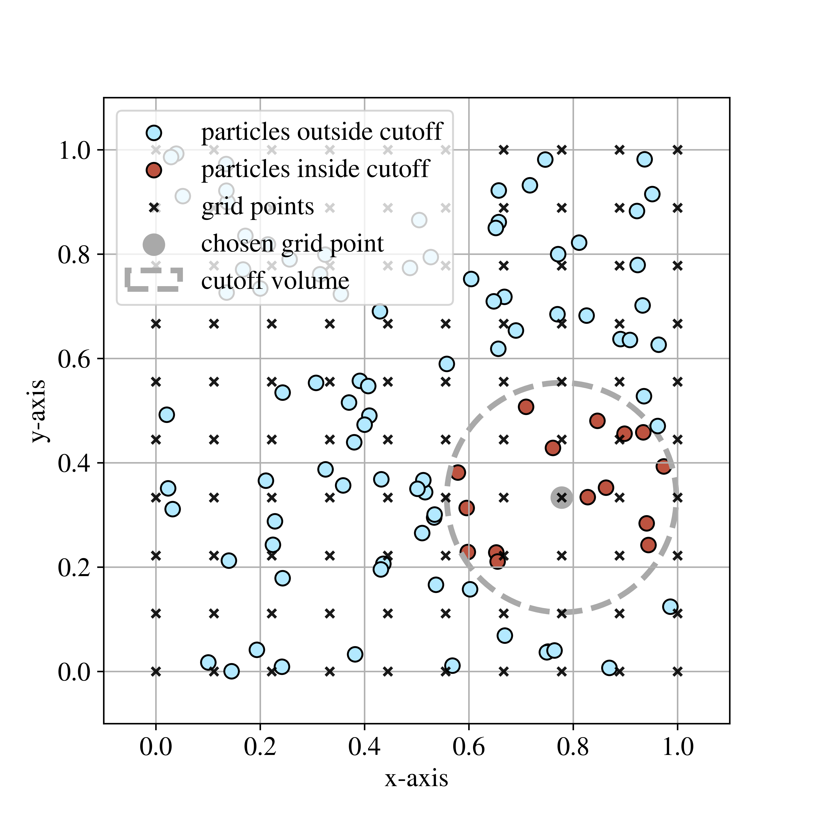
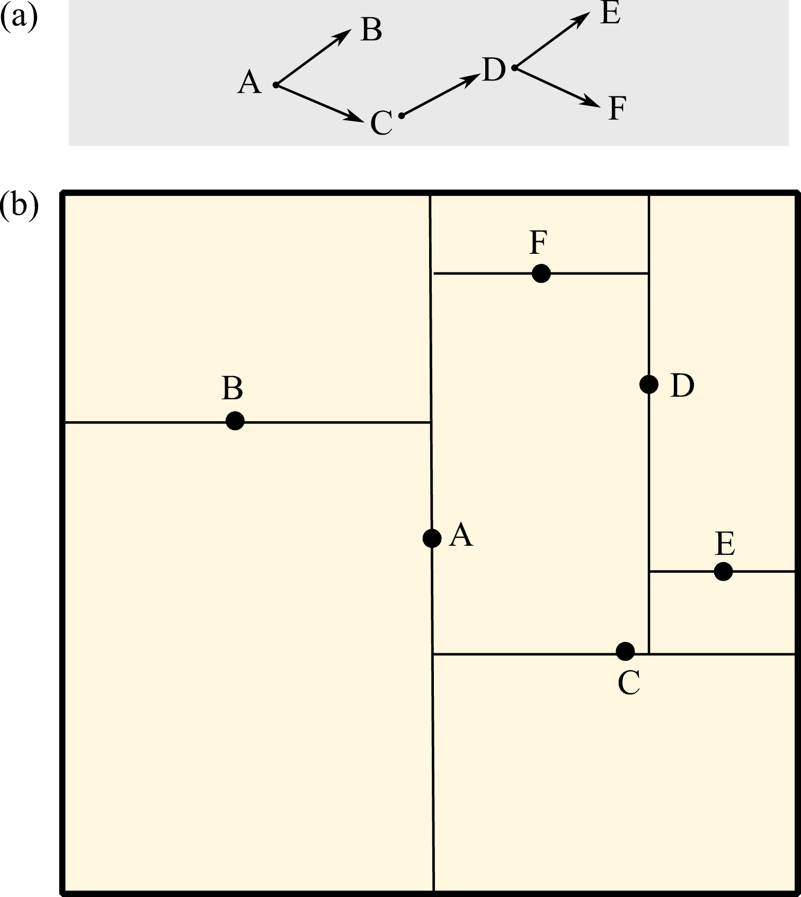
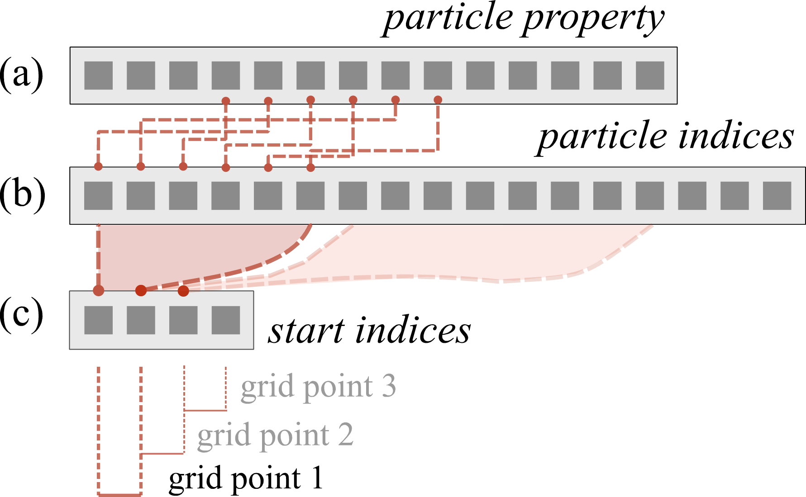

Neighbour Search
================

pysammos.neighbour\_search package

Subpackage containing neighbour search algorithms applied to associate
particles to grid points. 

   **Example of neighbour search.** Visualisation of particle-to-node association. This plot displays an xy-plane projection of a synthetic set of particle positions in 3D (blue dots) within the framework of a regular grid (crosses). 
   The particles associated to the grey grid point (red dots) are those within the cut-off volume (grey circle). The size of the dots is not informative of the size of the particles. For sake of simplicity, no units are provided.

.. automodule:: pysammos.neighbour_search
   :members:
   :undoc-members:
   :show-inheritance:

Grid Particle Search module
---------------------------

pysammos.neighbour\_search.grid\_particle\_search module

.. automodule:: pysammos.neighbour_search.grid_particle_search
   :members:
   :undoc-members:
   :show-inheritance:

A k-d tree is a data structure built from recursively bisecting the search space in every dimension and collecting the coordinates of those splitting planes. Below is a simplified example of a kd-tree in 2D:

   **Diagram of kd-tree neighbour search.** Simplified example of a kd-tree in 2D (a) corresponding to the divisions in space shown in (b). Each level of the tree corresponds to a labelled line in the spatial visualisation. 
   The levels of the tree alternate in axes (e.g., A is vertical, B and C are horizontal). Note that only a single branch is built completely, while others stop in earlier levels.

The particle-node association data are exported by the k-d tree algorithm as two arrays. The first array contains the indices of particle data arrays (e.g., position), for each particle at each grid point in sequential order.
The second array contains the offsets into the first array, providing the starting index of the particles associated with a given grid point. Note that this relation is correct given that the arrays containing particle data arrays are sorted by particle ID just after being read. 
Empty grid points (i.e., those with no particles within the cut-off radius) are handled by appearing as zero-length slices in the second array, thus ensuring both efficiency and robustness. See the figure below for a schematic representation.

   **Example of neighbour search output.** Schematic representation of the relation between the particle properties arrays (a) and the arrays exported by the function neighbour\_search.grid\_particle\_search.particle\_node\_match: the particle indices array (b),  containing the indices of particle properties arrays in sequential order for each particle at each grid point; and the start indices array (c), 
   providing the starting index of the particles associated with a given grid point. This relation is correct given that the arrays containing particle properties are sorted by particle ID.