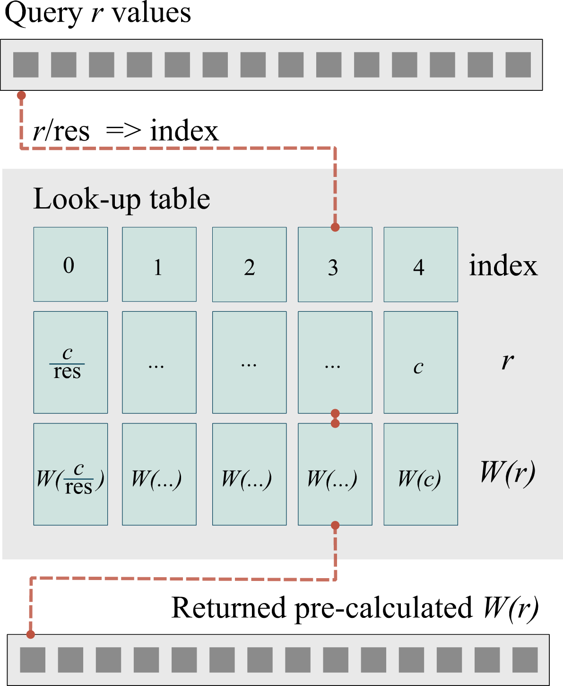
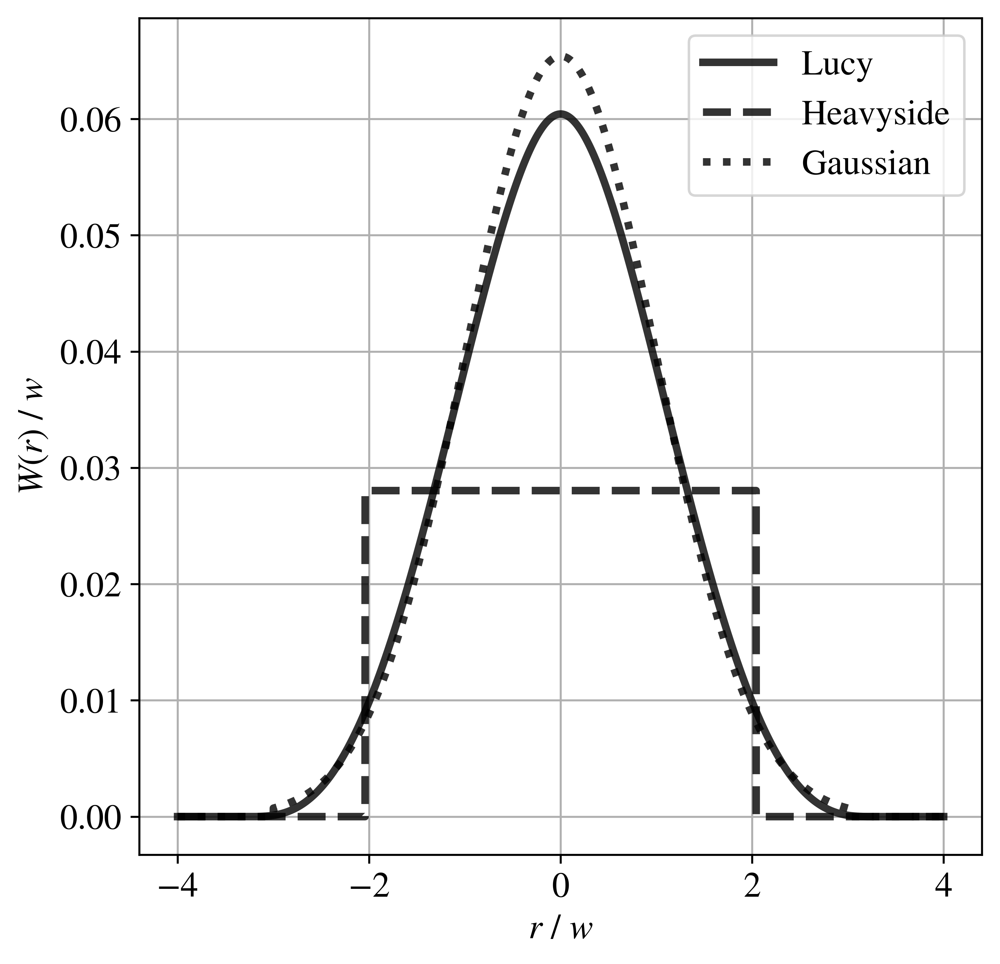

Spatial Weights
===============

pysammos.spatial\_weights package

Subpackage for spatial weighting functions and related utilities.

.. automodule:: pysammos.spatial_weights
   :members:
   :undoc-members:
   :show-inheritance:

This subpackage contains the following modules:

:ref:`hashtable_search_module`

:ref:`kernels_module`

:ref:`resolution_module`

.. _hashtable_search_module:
Hashtable Search module
-----------------------

pysammos.spatial\_weights.hashtable\_search module

To speed up repeated evaluations of the CG weights for particle-grid point pairs, we implemented a lookup table algorithm. 
This method discretises the input domain, and subsequently, evaluates the target function at those discrete points. 
The discretised points and their corresponding values yielded by the function are stored in a lookup table, with a corresponding index.
Next, the continuous query values are mapped to the discrete index of the lookup table by dividing by the step size and rounding down. 

   **Example of a lookup table.** Schematic diagram of the lookup table algorithm implemented in Pysammos. *r* corresponds to the distance between a particle and a grid point. 
   The resolution of the lookup table is *res*. *W(r)* is the Coarse-Graining function, and *c* corresponds to its cut-off distance (i.e., *W(c)*=0). 

.. automodule:: pysammos.spatial_weights.hashtable_search
   :members:
   :undoc-members:
   :show-inheritance:

.. _kernels_module:
Kernels module
--------------

pysammos.spatial\_weights.kernels module

   **Example of spatial weights kernels.** Visualisation of the three implemented Coarse-graining weighting functions, W(r), in one dimension (r) 
   normalised by the half-width (w). Note that the functions have been plotted with equal variance in order to ensure that any differences are due to kernel shape, not scale. 

.. automodule:: pysammos.spatial_weights.kernels
   :members:
   :undoc-members:
   :show-inheritance:

.. _resolution_module:
Resolution module
-----------------

pysammos.spatial\_weights.resolution module

.. automodule:: pysammos.spatial_weights.resolution
   :members:
   :undoc-members:
   :show-inheritance:

.. automodule:: pysammos.spatial_weights.utils
   :members:
   :undoc-members:
   :show-inheritance:
