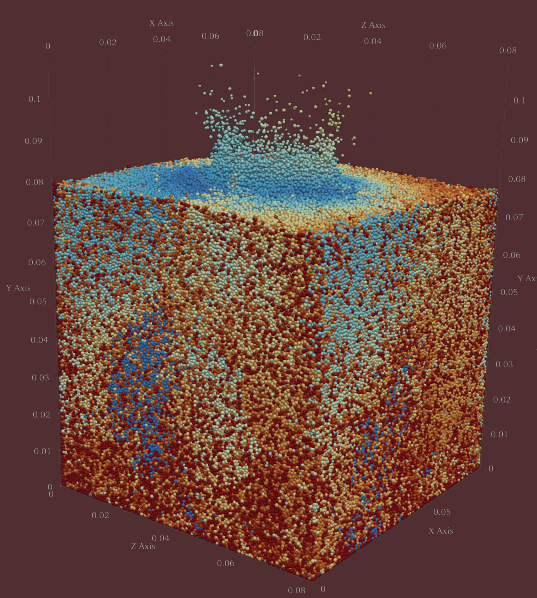

.. pysammos_docs documentation master file, created by
   sphinx-quickstart on Wed Aug 13 09:16:58 2025.
   You can adapt this file completely to your liking, but it should at least
   contain the root `toctree` directive.

Home
====

**Pysammos** is a Python package for coarse-graining and simulation analysis.

Features:

- Fast neighbor search with Numba acceleration
- Flexible grid-based coarse-graining
- Input/output for MFIX simulation data

      

**Who was the Sand Reckoner?**

The Sand (psammos, in greek) Reckoner is a work by Archimedes, in which he endeavoured to determine the 
number of grains of sand that could fit in the universe. To do so, he invented a new system of large number 
notation, as the number system at that time could only express numbers up to a myriad (10,000). 
Our open source code is able to process any granular model in the universe no matter the number of grains! In 
fact, the more, the *myriar*.

.. image:: _static/sand_reckoner.png
   :alt: sand reckoner logo
   :align: center
   :scale: 50%

.. toctree::
   :maxdepth: 1
   :caption: Contents:

   installation
   modules
   examples
   license
   

